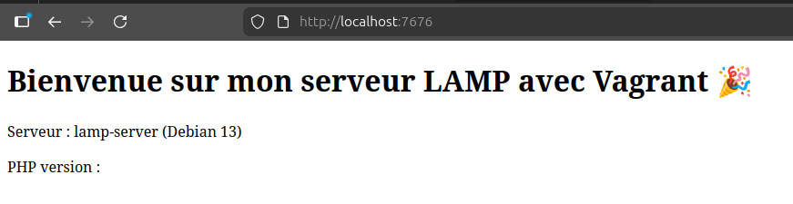
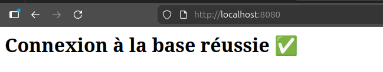

# README

<p align="left">
  <!-- Vagrant -->
  

  <!-- Bash -->
  

  <!-- HTML -->
  

  <!-- SQL -->
  

  <!-- PHP -->
  
</p>

---

## Practical Work – Vagrant

### Objectives
Gradually set up a virtual infrastructure using **Vagrant + VirtualBox** to learn :
- the concept of a *box*
- automated VM creation
- provisioning
- shared folders
- multi-VM modelling (web / database separation)

---

## Project 1 – Creating a Debian Base Box
### Specifications
Project: **vagrant-debian**
- Box: `bento/debian-13`
- Configuration:
  - VM Name: `debian-base`
  - RAM: **1024 MB**
  - CPU: **1**
  - Private Network: IP **192.168.56.10**
- The VM must:
  - launch with `vagrant up`
  - be accessible via `vagrant ssh`
  - display a custom message in `/etc/motd`

---

## Project 2 – VM with LAMP Stack + Shared Folder
### Specifications
Project: **vagrant-lamp**
- Box: `bento/debian-13`
- Configuration:
  - Hostname: `lamp-server`
  - Port forwarding: `7676 → 80`
  - Shared folder: `./shared → /var/www/html`
    - owner: www-data
    - group: www-data
    - fmode=644
    - dmode=755
- Provisioning:
  - Install Apache2
  - Install PHP + minimal extensions
  - Enable Apache on boot
  - Clean `/var/www/html`
  - Copy an `index.html` file into the shared folder
  - Edit `/etc/motd`
  - Script idempotent (`vagrant provision`)
- Access: http://ip:7676

### Preview


---

## Project 3 – Multi-VM Infrastructure: Web + Database
Project: **vagrant-web-db**

### VM 1: Database (db)
- Hostname: `db-server`
- Private IP: **192.168.56.11**
- RAM: 1024 MB — CPU: 1
- Provisioning:
  - Install MariaDB
  - Update configuration: `bind-address = 0.0.0.0`
  - External SQL script (`./db_sql/db_init.sql`) used to:
    - create database `tp_db`
    - create user `tp_user` with password `tp_password`
    - grant all privileges
  - Enable MariaDB on boot

### VM 2: Web Server (web)
- Hostname: `web-server`
- Private IP: **192.168.56.10**
- RAM: 1024 MB — CPU: 1
- Port forwarding: `8080 → 80`
- Provisioning:
  - Install Apache2 + PHP + php-mysql
  - Shared folder: `./shared → /var/www/html`
  - Install an `index.php` that tests connection to DB `192.168.56.11`

### Interconnection
- Private network allowing Web → DB communication (port 3306)

### Final Objective
Access from host: **http://ip:8080**

### Preview


---

## Bonus: phpMyAdmin Integration

As an optional enhancement to Exercise 3, phpMyAdmin has been installed on the **web** VM to provide a graphical interface for managing the MariaDB instance running on the **db** VM.

### Implementing

Use the configuration files of the `vagrant_web_db` and replace `web_provision.sh` by `web_provision_bonus.sh` in your Vagrantfile :

```ruby
web.vm.provision "shell", path: "./web_provision_bonus.sh"
```

### Preview


